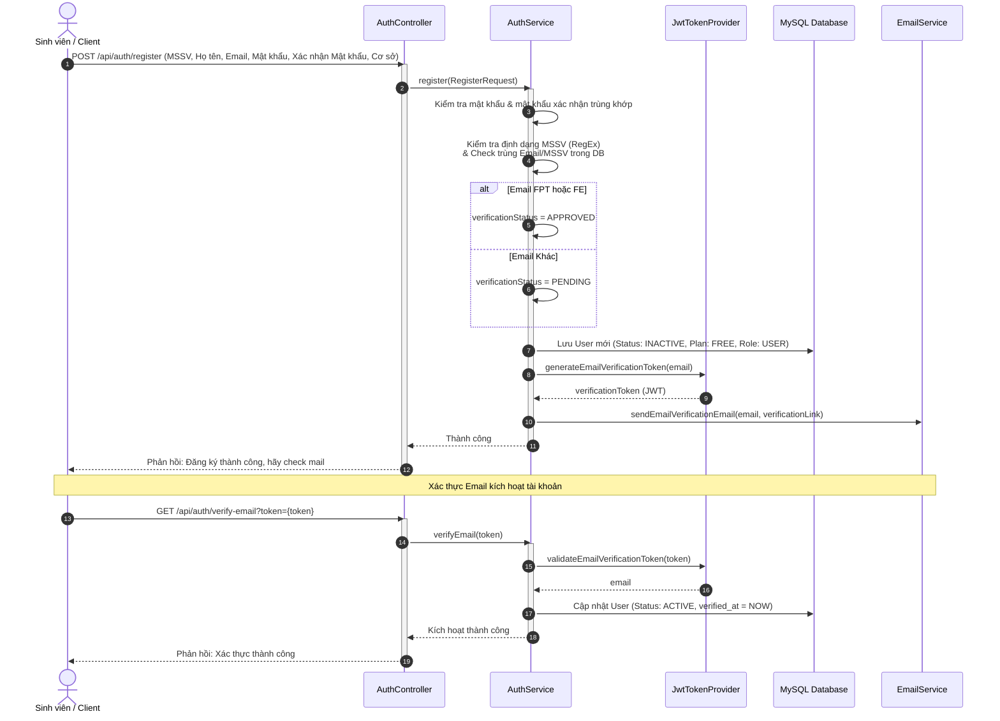
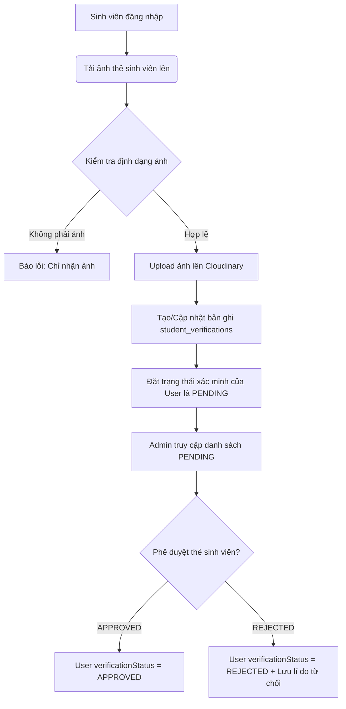
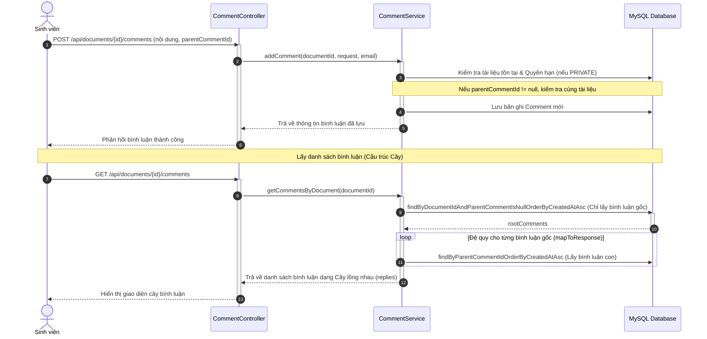
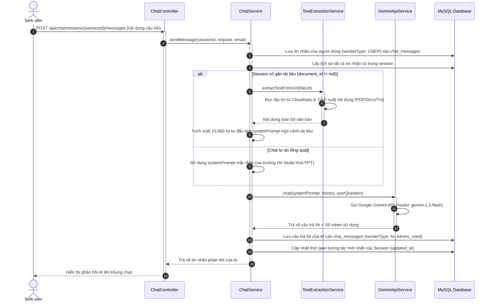
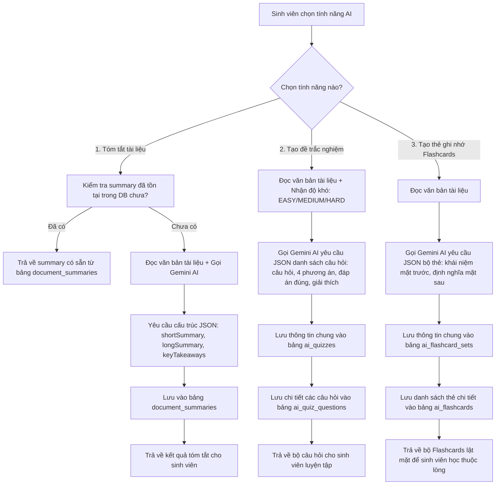
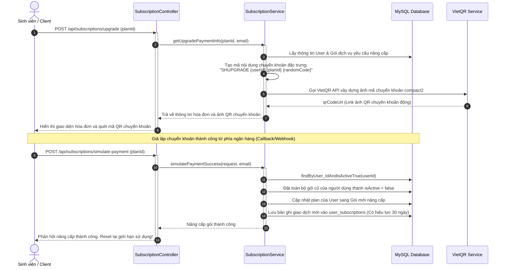

# Hướng Dẫn Các Luồng Xử Lý Hệ Thống (Processing Flows) - AI Study Hub FPT

Tài liệu này mô tả chi tiết toàn bộ các luồng xử lý nghiệp vụ chính trong dự án **AI Study Hub FPT** dựa trên cấu trúc cơ sở dữ liệu và mã nguồn Java Spring Boot (Backend).

---

## 1. Tổng Quan Kiến Trúc & Công Nghệ

Hệ thống được thiết kế theo mô hình **Client-Server** với cấu trúc phân tầng chuẩn của Spring Boot:
- **API Entrypoint**: Các `Controller` tiếp nhận yêu cầu HTTP RESTful từ Frontend (ReactJS).
- **Security Layer**: `JwtAuthenticationFilter` và `JwtTokenProvider` chặn các request để xác thực JWT token (Access Token nằm ở header `Authorization: Bearer <token>`).
- **Business Logic**: Các lớp `Service` xử lý nghiệp vụ, giao tiếp với các dịch vụ bên ngoài (Cloudinary, Gemini API).
- **Data Access Layer**: Các interface `Repository` kế thừa Spring Data JPA để tương tác với cơ sở dữ liệu MySQL.

---

## 2. Chi Tiết Các Luồng Xử Lý Nghiệp Vụ

### Luồng 1: Đăng Ký & Xác Thực Người Dùng (User Registration & Authentication)

Luồng này chịu trách nhiệm đăng ký tài khoản sinh viên mới, xác thực email qua link, đăng nhập xoay vòng token JWT (Token Rotation), đổi mật khẩu và khôi phục mật khẩu khi quên.



#### Quy trình chi tiết:
1. **Đăng ký tài khoản (`/api/auth/register`)**:
   - Nhận thông tin từ client. Kiểm tra tính trùng khớp của mật khẩu và mật khẩu xác nhận (`confirmPassword`). Nếu không trùng khớp, trả về lỗi ngay lập tức.
   - Kiểm tra định dạng MSSV bằng biểu thức chính quy (Regex: `^[A-Z]{2,4}\d{5,7}$`, ví dụ: `SE160000`).
   - Kiểm tra tính duy nhất của `email` và `studentCode` trong bảng `users`.
   - Nếu email có đuôi `@fpt.edu.vn` hoặc `@fe.edu.vn`, tự động đặt trạng thái xác minh sinh viên (`verification_status`) là `APPROVED`. Ngược lại đặt là `PENDING` (sẽ cần upload thẻ sinh viên sau).
   - Mã hóa mật khẩu thông qua `PasswordEncoder` (BCrypt).
   - Lưu tài khoản mới vào cơ sở dữ liệu với trạng thái `status = INACTIVE`, gói cước mặc định `plan = FREE`, và vai trò `role = USER`.
   - Tạo email verification token (JWT ký số có thời hạn) và gửi email chứa đường link kích hoạt tài khoản (`/verify-email?token=...`) đến email của sinh viên.
2. **Kích hoạt tài khoản (`/api/auth/verify-email`)**:
   - Giải mã và xác thực token kích hoạt email.
   - Tìm kiếm người dùng tương ứng và cập nhật trạng thái `status` từ `INACTIVE` thành `ACTIVE`, đồng thời ghi nhận thời gian xác thực `verified_at`.
3. **Đăng nhập (`/api/auth/login`)**:
   - Sử dụng `AuthenticationManager` để xác thực cặp thông tin `email` / `password`.
   - Kiểm tra trạng thái tài khoản: Nếu là `INACTIVE` yêu cầu xác thực email; nếu là `BANNED` chặn quyền truy cập.
   - Sinh **Access Token** (JWT chứa thông tin email, role, họ tên dùng cho các request tiếp theo) và **Refresh Token** (UUID ngẫu nhiên, lưu trữ trong bảng `refresh_tokens` có hiệu lực trong 7 ngày).
4. **Làm mới Token (`/api/auth/refresh`)**:
   - Client gửi Refresh Token cũ lên hệ thống.
   - Hệ thống kiểm tra xem Refresh Token có tồn tại, đã bị thu hồi (`revoked = true`) hay hết hạn chưa.
   - Nếu hợp lệ, hệ thống thực hiện cơ chế **Token Rotation**: Xóa Refresh Token cũ trong DB, tạo một Refresh Token mới lưu vào DB và cấp Access Token mới trả về cho Client.
5. **Đăng xuất (`/api/auth/logout`)**:
   - Thu hồi phiên bằng cách xóa bản ghi Refresh Token tương ứng trong cơ sở dữ liệu.
6. **Khôi phục mật khẩu (`/api/auth/forgot-password` & `/api/auth/reset-password`)**:
   - Gửi yêu cầu quên mật khẩu: Sinh token đặt lại mật khẩu tạm thời gửi qua email.
   - Đặt lại mật khẩu mới: Xác thực token khôi phục, đổi mật khẩu mới (đã mã hóa) của User và **xóa toàn bộ các Refresh Tokens cũ** của tài khoản đó trong database để buộc tất cả các thiết bị khác phải đăng xuất.

#### Các API Endpoints liên quan:
- `POST /api/auth/register` (Công khai)
- `GET /api/auth/verify-email` (Công khai)
- `POST /api/auth/login` (Công khai)
- `POST /api/auth/refresh` (Công khai)
- `POST /api/auth/logout` (Yêu cầu đăng nhập)
- `POST /api/auth/forgot-password` (Công khai)
- `POST /api/auth/reset-password` (Công khai)
- `POST /api/auth/change-password` (Yêu cầu đăng nhập)

---

### Luồng 2: Xác Minh Danh Tính Sinh Viên (Student Card Verification Flow)

Dành cho những sinh viên đăng ký bằng tài khoản email thông thường không phải email trường. Sinh viên cần gửi ảnh thẻ sinh viên để Admin phê duyệt thủ công.



#### Quy trình chi tiết:
1. **Gửi yêu cầu xác minh (`/api/users/verify-student`)**:
   - Sinh viên đăng tải file ảnh thẻ sinh viên (`MultipartFile`).
   - Kiểm tra định dạng tệp tin phải thuộc định dạng ảnh (`image/*`).
   - Tìm kiếm xem người dùng đã từng gửi yêu cầu xác minh trước đó chưa (bảng `student_verifications`).
   - Nếu đã có yêu cầu cũ, hệ thống tiến hành xóa ảnh thẻ cũ trên **Cloudinary** để dọn dẹp bộ nhớ và cập nhật bản ghi hiện tại.
   - Upload ảnh mới lên thư mục `student_verifications` của Cloudinary để lấy đường dẫn CDN (`imageUrl`).
   - Thiết lập trạng thái xác minh của yêu cầu là `PENDING`, xóa các ghi chú từ chối (`review_note`), admin duyệt (`reviewed_by`) trước đó.
   - Cập nhật trạng thái `verificationStatus` của User thành `PENDING`.
2. **Admin duyệt xác minh (`/api/admin/verifications/{id}/review`)**:
   - Admin xem danh sách các yêu cầu đang chờ (`PENDING`).
   - Admin gửi phê duyệt `APPROVED` hoặc từ chối `REJECTED` (kèm theo lý do từ chối `reviewNote`).
   - Cập nhật trạng thái của bản ghi xác minh và trạng thái `verificationStatus` của sinh viên trong bảng `users`. Đồng thời ghi nhận thời gian duyệt `reviewed_at` và ID người duyệt `reviewed_by`.

#### Các API Endpoints liên quan:
- `POST /api/users/verify-student` (Role: USER)
- `GET /api/admin/verifications/pending` (Role: ADMIN)
- `POST /api/admin/verifications/{id}/review` (Role: ADMIN)

---

### Luồng 3: Quản Lý Tài Liệu & Thư Mục (Document & Folder Management Flow)

Sinh viên quản lý học tập cá nhân bằng cấu trúc cây thư mục và upload tài liệu bài giảng, đề thi. Tài liệu có thể được phân loại, gắn tags và thiết lập quyền riêng tư.

#### Quy trình chi tiết:
1. **Tạo thư mục (`POST /api/folders`)**:
   - Sinh viên tạo thư mục. Thư mục có thể nằm ở thư mục gốc (`parent_folder_id = null`) hoặc lồng nhau tạo cấu trúc thư mục con (`parent_folder_id` trỏ tới ID của thư mục cha).
   - Ràng buộc cơ sở dữ liệu ngăn chặn việc trùng tên thư mục của cùng một người dùng trong cùng một thư mục cha (`UNIQUE(user_id, parent_folder_id, folder_name)`).
2. **Tải lên tài liệu (`POST /api/documents/upload`)**:
   - Tiếp nhận file tài liệu bài học (`pdf`, `docx`, `pptx`, `txt`, `zip`) và thông tin JSON (tiêu đề, mô tả, môn học `courseId`, phân mục `categoryId`, thư mục lưu trữ `folderId`, từ khóa `tags`, trạng thái chia sẻ `visibility`).
   - Phân tích đuôi mở rộng của tệp để lưu đúng trường `file_type`.
   - Tải tệp lên thư mục `documents` của **Cloudinary** để nhận link CDN lưu vào database.
   - Lưu trữ các nhãn tag: Duyệt qua danh sách tag, tag nào chưa có trong bảng `tags` thì tạo mới, sau đó thiết lập liên kết ở bảng trung gian `document_tags`.
   - Đặt trạng thái kiểm duyệt mặc định là `APPROVED` (có thể cập nhật luồng duyệt thủ công sau).
   - Thiết lập trạng thái chia sẻ mặc định nếu không truyền là `PRIVATE`.
3. **Chuyển thư mục tài liệu (`PUT /api/documents/{id}/move`)**:
   - Sinh viên chuyển tài liệu học sang thư mục khác bằng cách cập nhật `folder_id` của tài liệu. Yêu cầu kiểm tra quyền sở hữu của sinh viên đối với cả tài liệu và thư mục đích.
4. **Xem tài liệu và ghi nhận lịch sử (`GET /api/documents/{id}`)**:
   - Nếu tài liệu ở trạng thái `PRIVATE`, chỉ cho phép chủ sở hữu tài liệu truy cập.
   - Nếu tài liệu ở trạng thái `PUBLIC` (và đã được phê duyệt kiểm duyệt), cho phép tất cả sinh viên (hoặc khách vãng lai) truy cập.
   - Khi tài liệu được tải chi tiết thành công, hệ thống tăng số lượt xem `total_views` của tài liệu lên `1` và đồng thời tạo một bản ghi lịch sử xem trong bảng `document_views`.
5. **Tải xuống tài liệu (`GET /api/documents/{id}/download`)**:
   - Yêu cầu sinh viên đăng nhập hệ thống.
   - Tăng chỉ số số lượt tải xuống `total_downloads` lên `1` và ghi nhận nhật ký tải xuống vào bảng `document_downloads`.
   - Trả về thông tin siêu dữ liệu chứa `fileUrl` để client thực hiện tải file.
6. **Xóa tài liệu (`DELETE /api/documents/{id}`)**:
   - Xóa tệp tin vật lý lưu trữ trên hệ thống Cloudinary để tối ưu hóa bộ nhớ cloud.
   - Xóa bản ghi tài liệu trong cơ sở dữ liệu MySQL (và tự động cascade xóa các dữ liệu liên quan ở các bảng bình luận, yêu thích, tag liên kết).

#### Các API Endpoints liên quan:
- `POST /api/folders` & `GET /api/folders` & `GET /api/folders/{id}` (Role: USER)
- `POST /api/documents/upload` (Role: USER)
- `PUT /api/documents/{id}/move` (Role: USER)
- `GET /api/documents/{id}` (Công khai / Private)
- `GET /api/documents/{id}/download` (Role: USER)
- `DELETE /api/documents/{id}` (Role: USER)
- `GET /api/documents/search` (Công khai)
- `GET /api/documents/history` (Role: USER - Lịch sử đã xem)

---

### Luồng 4: Tính Năng Cộng Đồng & Tương Tác (Community Interactions Flow)

Sinh viên tương tác với các tài liệu học tập công khai bằng cách bình luận đệ quy, đánh giá xếp hạng sao, lưu trữ tài liệu yêu thích, chia sẻ trực tiếp và báo cáo vi phạm.



#### Quy trình chi tiết:
1. **Đánh giá tài liệu (Ratings - `POST /api/documents/{id}/ratings`)**:
   - Sinh viên gửi số sao đánh giá (từ `1` đến `5`).
   - Nếu sinh viên đã đánh giá tài liệu này trước đó, hệ thống sẽ cập nhật điểm số mới. Nếu chưa, tạo mới bản ghi trong bảng `document_ratings`.
   - **Tự động tính toán lại điểm trung bình (`average_rating`)**: Sau khi lưu, hệ thống chạy truy vấn lấy trung bình cộng tất cả đánh giá của tài liệu đó và cập nhật trực tiếp vào trường `average_rating` của bảng `documents`.
2. **Yêu thích tài liệu (Favorites - `POST / DELETE /api/documents/{id}/favorite`)**:
   - Cho phép sinh viên lưu trữ (bookmark) tài liệu học tập vào danh sách yêu thích cá nhân (bảng `favorites`).
3. **Bình luận phân cấp đệ quy (Threaded Comments - `/api/documents/{documentId}/comments`)**:
   - **Thêm bình luận**: Sinh viên gửi bình luận kèm nội dung. Nếu phản hồi bình luận khác, truyền kèm `parentCommentId` (phải đảm bảo bình luận cha thuộc cùng tài liệu).
   - **Xóa bình luận**: Chỉ tác giả bình luận hoặc chủ sở hữu tài liệu được xóa bình luận. Hệ thống thực hiện **Soft Delete (Xóa mềm)** bằng cách cập nhật cột `deleted_at = NOW()` để giữ nguyên tính toàn vẹn của cây bình luận (tránh mất các phản hồi con bên dưới).
   - **Lấy danh sách cây bình luận**: Hệ thống chỉ truy vấn các bình luận gốc (`parent_comment_id IS NULL`). Sau đó, ứng với mỗi bình luận, hàm đệ quy `mapToResponse` tự động tìm kiếm các bình luận phản hồi con (`parent_comment_id = id`) tạo thành một mảng `replies` lồng nhau gửi về client.
4. **Chia sẻ tài liệu trực tiếp (Document Sharing - `POST /api/documents/{id}/share`)**:
   - Chủ sở hữu tài liệu có thể chia sẻ tài liệu của mình với người dùng khác thông qua email của họ.
   - Thiết lập quyền hạn chi tiết: `VIEW` (Chỉ xem) hoặc `EDIT` (Có quyền sửa đổi thông tin). Bản ghi lưu ở bảng `document_shares`.
5. **Báo cáo vi phạm (Reports - `POST /api/documents/{id}/report`)**:
   - Sinh viên báo cáo tài liệu vi phạm quy chế (Spam, Bản quyền, Nội dung không phù hợp, Khác). Lưu ở bảng `reports` với trạng thái ban đầu là `PENDING` để Admin xử lý.

#### Các API Endpoints liên quan:
- `POST /api/documents/{id}/ratings` (Role: USER)
- `POST /api/documents/{id}/favorite` & `DELETE /api/documents/{id}/favorite` (Role: USER)
- `GET /api/documents/favorites` (Role: USER - Danh sách yêu thích của tôi)
- `POST /api/documents/{documentId}/comments` & `GET /api/documents/{documentId}/comments` (Role: USER)
- `PUT /api/comments/{commentId}` & `DELETE /api/comments/{commentId}` (Role: USER)
- `POST /api/documents/{id}/share` & `GET /api/documents/shared` (Role: USER)
- `POST /api/documents/{id}/report` (Role: USER)

---

### Luồng 5: Trợ Lý Trò Chuyện AI (AI Chat & Document Context Flow)

Sinh viên trò chuyện trực tiếp với AI trợ lý học tập của trường để giải đáp các kiến thức học thuật nói chung, hoặc yêu cầu AI đọc và trả lời câu hỏi trực tiếp dựa trên nội dung tài liệu cụ thể.



#### Quy trình chi tiết:
1. **Tạo phiên chat (`POST /api/chat/sessions`)**:
   - Sinh viên tạo phiên chat mới. Có thể truyền `documentId` để liên kết phiên chat với tài liệu đó (giúp hỏi đáp xoáy sâu vào tài liệu học tập).
   - Tên phiên chat mặc định sẽ là `"Trò chuyện về: [Tên tài liệu]"` hoặc `"Cuộc trò chuyện mới"`.
2. **Gửi tin nhắn & sinh câu trả lời thông minh (`POST /api/chat/sessions/{sessionId}/messages`)**:
   - Sinh viên gửi câu hỏi. Câu hỏi được lưu ngay vào bảng `chat_messages` với vai trò là `USER`.
   - Hệ thống tải toàn bộ lịch sử tin nhắn trước đó của phiên chat này nhằm duy trì mạch hội thoại (Memory).
   - **Xác định System Prompt**:
     - *Nếu chat tự do*: Đặt prompt hệ thống định danh mặc định: *"Bạn là trợ lý học tập AI của hệ thống AI Study Hub FPT..."*.
     - *Nếu chat theo ngữ cảnh tài liệu*: Hệ thống lấy đường dẫn tài liệu từ Cloudinary, gọi `TextExtractionService` để tải file và đọc nội dung văn bản. Nhằm tránh tràn giới hạn token của mô hình, hệ thống **cắt lấy tối đa 15.000 ký tự đầu tiên** của văn bản và đưa vào prompt hệ thống: *"Bạn là trợ lý học tập AI. Hãy trả lời các câu hỏi dựa trên nội dung tài liệu sau đây: [15k ký tự tài liệu]"*.
   - Gọi **Gemini API** qua phương thức POST đến API của Google (`gemini-1.5-flash` được cấu hình mặc định trong `GeminiConfig`).
   - Nhận phản hồi văn bản và số lượng tokens tiêu hao (`usageMetadata.totalTokenCount`), lưu tin nhắn mới vào cơ sở dữ liệu với vai trò `AI` và cập nhật trường `updated_at` của Session.

#### Các API Endpoints liên quan:
- `POST /api/chat/sessions` (Role: USER)
- `GET /api/chat/sessions` (Role: USER - Danh sách các phiên trò chuyện của tôi)
- `GET /api/chat/sessions/{sessionId}/messages` (Role: USER - Lịch sử tin nhắn)
- `POST /api/chat/sessions/{sessionId}/messages` (Role: USER)

---

### Luồng 6: Công Cụ Học Tập AI Nâng Cao (Advanced AI Study Tools Flow)

Sinh viên yêu cầu AI phân tích tài liệu để tự động sản xuất các công cụ bổ trợ học tập: Tóm tắt bài học (Summary), Đề trắc nghiệm ôn thi (Quizzes) và Thẻ ghi nhớ học thuật (Flashcards).

> [!IMPORTANT]
> **Điểm khác biệt thực tế giữa mã nguồn và mô tả tổng quan (README):**
> Theo file `README.md`, các tính năng AI Summary, Quiz và Flashcards không được lưu giữ (discarded afterward).
> Tuy nhiên, trong mã nguồn thực tế (lớp `AiAssistService` và file `schema.sql`), **tất cả các tính năng này đều được lưu trữ lâu dài vào cơ sở dữ liệu** (các bảng `document_summaries`, `ai_quizzes`, `ai_quiz_questions`, `ai_flashcard_sets`, `ai_flashcards`) để tối ưu hiệu năng và cho phép sinh viên học lại nhiều lần mà không cần gọi lại AI gây tốn phí.



#### Quy trình chi tiết:
1. **Tóm tắt văn bản (AI Summary - `POST /api/ai/documents/{documentId}/summary`)**:
   - Kiểm tra xem tài liệu này đã có bản tóm tắt nào lưu ở bảng `document_summaries` chưa. Nếu có thì trả về ngay lập tức để tiết kiệm chi phí gọi API.
   - Nếu chưa có, sử dụng `TextExtractionService` đọc văn bản tài liệu (lấy tối đa 15.000 ký tự).
   - Thiết lập prompt yêu cầu Gemini trả về cấu trúc JSON chuẩn:
     ```json
     {
       "shortSummary": "Tóm tắt ngắn gọn dưới 1000 ký tự",
       "longSummary": "Tóm tắt chi tiết các phần quan trọng",
       "keyTakeaways": ["Ý chính 1", "Ý chính 2", ...]
     }
     ```
   - Hệ thống làm sạch Markdown Code Block (bỏ thẻ bao quanh ` ```json `), phân tách chuỗi thành đối tượng Java qua `ObjectMapper` và lưu vào bảng `document_summaries`.
2. **Tạo bộ đề trắc nghiệm (AI Quiz - `POST /api/ai/documents/{documentId}/quiz`)**:
   - Đọc văn bản tài liệu và nhận mức độ khó yêu cầu (`EASY`, `MEDIUM`, `HARD`).
   - Gửi yêu cầu Gemini tạo bộ câu hỏi gồm 5 đến 10 câu trắc nghiệm bằng tiếng Việt, ép kiểu trả về dạng JSON chứa tiêu đề bài trắc nghiệm và danh sách câu hỏi chi tiết (gồm nội dung câu hỏi, 4 phương án A-B-C-D, đáp án đúng và phần giải thích cặn kẽ vì sao đúng).
   - Phân tích dữ liệu JSON trả về:
     - Tạo một bản ghi thông tin chung trong bảng `ai_quizzes`.
     - Tạo danh sách các câu hỏi liên kết trong bảng `ai_quiz_questions`.
   - Trả về cấu trúc bộ đề đầy đủ cho Client làm bài kiểm tra.
3. **Tạo thẻ Flashcard (AI Flashcards - `POST /api/ai/documents/{documentId}/flashcards`)**:
   - Trích xuất văn bản tài liệu.
   - Gửi yêu cầu Gemini sinh từ 8 đến 15 cặp thẻ thuật ngữ ghi nhớ nhanh theo định dạng JSON chứa tên bộ flashcard, mô tả ngắn, nội dung mặt trước (thuật ngữ/câu hỏi), nội dung mặt sau (định nghĩa/câu trả lời).
   - Lưu trữ thông tin bộ thẻ vào bảng `ai_flashcard_sets` và chi tiết các thẻ vào bảng `ai_flashcards`.

#### Các API Endpoints liên quan:
- `POST /api/ai/documents/{documentId}/summary` (Role: USER - Kích hoạt tạo)
- `GET /api/ai/documents/{documentId}/summary` (Công khai - Lấy lại bản tóm tắt đã có)
- `POST /api/ai/documents/{documentId}/quiz` (Role: USER)
- `GET /api/ai/documents/{documentId}/quizzes` (Công khai - Xem danh sách đề trắc nghiệm của tài liệu)
- `GET /api/ai/quizzes/{quizId}` (Công khai - Xem chi tiết đề thi trắc nghiệm)
- `POST /api/ai/documents/{documentId}/flashcards` (Role: USER)
- `GET /api/ai/documents/{documentId}/flashcard-sets` (Công khai - Danh sách bộ flashcard của tài liệu)
- `GET /api/ai/flashcards/{setId}` (Công khai - Chi tiết bộ thẻ ghi nhớ)

---

### Luồng 7: Nâng Cấp Gói Cước & Giả Lập Thanh Toán (Subscription & Payment Simulation Flow)

Người dùng nâng cấp tài khoản từ gói FREE lên gói PRO hoặc PREMIUM để tăng dung lượng lưu trữ tài liệu cá nhân và số lượng yêu cầu AI trong ngày. Hệ thống hỗ trợ tạo mã VietQR động để chuyển khoản ngân hàng và kiểm tra xác nhận giao dịch giả lập.



#### Quy trình chi tiết:
1. **Lấy danh sách các gói dịch vụ (`/api/subscriptions/plans`)**:
   - Trả về danh sách các gói cước đang hoạt động (`FREE`, `PRO`, `PREMIUM`) cùng thông số giới hạn bộ nhớ lưu trữ (`storage_limit_mb`) và số câu hỏi AI trong ngày (`ai_requests_per_day`).
2. **Yêu cầu nâng cấp gói (`/api/subscriptions/upgrade`)**:
   - Sinh viên gửi ID gói muốn nâng cấp.
   - Hệ thống kiểm tra: Không cho phép tự nâng cấp về gói `FREE`.
   - Hệ thống sinh một **mã nội dung chuyển khoản ngẫu nhiên nhưng định danh duy nhất**:
     - Cấu trúc: `SHUPGRADE [userId] [planId] [mã số ngẫu nhiên 4 chữ số]`.
     - Ví dụ: `SHUPGRADE 12 3 8741` (Nâng cấp User 12 lên Plan 3).
   - Hệ thống tự động tạo URL mã QR chuyển khoản chuẩn ngân hàng thông qua cổng thanh toán quốc gia VietQR (`https://img.vietqr.io/image/...`) compact2 bao gồm: Tên ngân hàng (`MB`), Số tài khoản công ty (`1234567890`), Tên chủ tài khoản (`CONG TY AI STUDYHUB FPT`), số tiền bằng giá gói cước, và thông tin nội dung chuyển khoản được mã hóa URL.
   - Trả về thông tin hóa đơn giao dịch cùng URL ảnh QR cho sinh viên quét mã trên App ngân hàng.
3. **Giả lập thanh toán thành công (`/api/subscriptions/simulate-payment`)**:
   - Giả lập cơ chế Webhook/IPN nhận tiền từ Ngân hàng.
   - Khi nhận được tín hiệu thành công, hệ thống truy vấn và đặt trạng thái hoạt động của toàn bộ các gói dịch vụ trước đây của người dùng thành không hoạt động (`isActive = false`).
   - Cập nhật trực tiếp gói dịch vụ mới vào trường `plan_id` của tài khoản người dùng trong bảng `users`.
   - Tạo mới một bản ghi giao dịch trong bảng `user_subscriptions`, ghi nhận thời gian bắt đầu (`start_date` là hiện tại) và thời gian kết thúc (`end_date` là sau 30 ngày).
   - Cập nhật tức thì các giới hạn về dung lượng và lượt truy cập AI của tài khoản đó.

#### Các API Endpoints liên quan:
- `GET /api/subscriptions/plans` (Công khai)
- `POST /api/subscriptions/upgrade` (Role: USER)
- `POST /api/subscriptions/simulate-payment` (Role: USER - Mocking Webhook)
- `GET /api/subscriptions/history` (Role: USER - Xem lịch sử hóa đơn thanh toán cá nhân)

---

### Luồng 8: Quản Trị Hệ Thống & Kiểm Duyệt (Admin Moderation & System Configurations)

Dành cho Admin của AI Study Hub nhằm giám sát, kiểm duyệt nội dung chia sẻ cộng đồng, xử lý các báo cáo vi phạm, quản lý tài khoản người dùng và thiết lập cấu hình chung của toàn trường FPT.

#### Quy trình chi tiết:
1. **Kiểm duyệt tài liệu (`POST /api/admin/documents/{id}/moderate`)**:
   - Admin kiểm tra nội dung tài liệu bài giảng/đề thi sinh viên chia sẻ lên cộng đồng.
   - Admin cập nhật trạng thái `moderationStatus` của tài liệu thành `APPROVED` (Cho phép xuất hiện công khai trên bảng tin tìm kiếm chung) hoặc `REJECTED` (Ẩn tài liệu và gửi cảnh báo).
2. **Xử lý báo cáo vi phạm (`POST /api/admin/reports/{id}/resolve`)**:
   - Xem danh sách báo cáo vi phạm (`reports`) do sinh viên gửi lên.
   - Admin ra quyết định giải quyết (`RESOLVED` hoặc `REJECTED`).
   - Nếu vi phạm nghiêm trọng, admin có thể khóa tài liệu hoặc khóa tài khoản của người đăng tải.
3. **Quản lý người dùng (`POST /api/admin/users/{id}/ban` & `/api/admin/users/{id}/unban`)**:
   - Admin kiểm soát danh sách người dùng.
   - Khóa tài khoản (`ban`): Cập nhật trạng thái người dùng thành `BANNED`. Khi tài khoản ở trạng thái này, hệ thống sẽ từ chối đăng nhập ở bộ lọc bảo mật Spring Security và khóa tất cả Refresh Tokens.
   - Mở khóa tài khoản (`unban`): Khôi phục trạng thái hoạt động về `ACTIVE`.
4. **Quản lý cấu hình danh mục học tập (CRUD configurations)**:
   - Admin có toàn quyền tạo mới, chỉnh sửa, xóa bỏ các cấu hình hệ thống:
     - **Ngành học (Majors)**: SE, AI, BA, GD, etc.
     - **Môn học (Courses)**: SWP391, PRJ301, DBI202, OSG202, etc. (Có liên kết khóa ngoại với Ngành học).
     - **Phân mục tài liệu (Document Categories)**: Lecture, Assignment, Exam, Lab, Notes, Reference.
     - **Gói dịch vụ (Subscription Plans)**: Định cấu hình giá tiền, giới hạn bộ nhớ (MB), giới hạn số lượt hỏi AI hàng ngày.

#### Các API Endpoints liên quan:
- `GET /api/admin/users` & `POST /api/admin/users/{id}/ban` & `POST /api/admin/users/{id}/unban` (Role: ADMIN)
- `GET /api/admin/documents` & `POST /api/admin/documents/{id}/moderate` (Role: ADMIN)
- `GET /api/admin/reports` & `POST /api/admin/reports/{id}/resolve` (Role: ADMIN)
- Cụm APIs CRUD:
  - `GET/POST/PUT/DELETE /api/admin/majors`
  - `GET/POST/PUT/DELETE /api/admin/courses`
  - `GET/POST/PUT/DELETE /api/admin/categories`
  - `GET/POST/PUT/DELETE /api/admin/plans`
